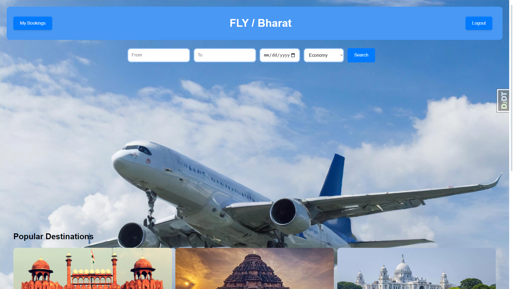

# FLY-BHARAT

## Overview
FLY-BHARAT is a college project involving the development of a flight booking application using Django, a popular Python-based web framework. This application provides functionality for searching and booking flights, offering a simple and intuitive interface for users.

## Features

- **Flight Search and Booking**: Users can search for available flights and make reservations.
- **User Authentication**: Includes features for user registration, login, and profile management.
- **Flight Data Management**: Provides flight data handling through the `flightdata` module.

## Technologies Used

- **Backend**: Django (Python)
- **Frontend**: HTML, CSS, JavaScript
- **Database**: SQLite3

## Setup Instructions

1. Clone the repository:
   ```sh
   git clone https://github.com/Fly-BharatPROJECT/airline.git
   ```
2. Navigate to the project directory:
   ```sh
   cd airline-main
   ```
3. Install the required dependencies:
   ```sh
   pip install -r requirements.txt
   ```
4. Run the application:
   ```sh
   python manage.py runserver
   ```

## Folder Structure

- **airline**: Contains core application files.
- **apps**: Holds custom Django apps for the project.
- **flightdata**: Module handling flight-related data.
- **productionfiles**: Files for deployment settings.
- **virtu**: Virtual environment files.

## License

This project is licensed for educational purposes.

## Contributors

This project was developed as part of a college assignment by a dedicated team of students interested in web development using Django.

